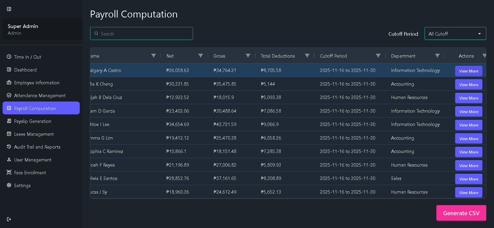

# Nexus Payroll

**Nexus Payroll** is a comprehensive, end-to-end payroll management system designed to automate and streamline the entire payroll process from employee time tracking to payslip generation. The system minimizes manual intervention by integrating advanced technologies such as facial recognition for time logging, automated attendance processing, and intelligent payroll computation.

### Demo Account

**Email:** superadmin@gmail.com  
**Password:** Pass1234  

🚀 **Live Demo:** https://nexus-payroll.vercel.app

